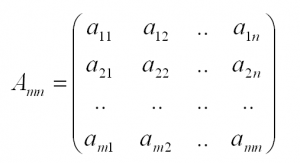
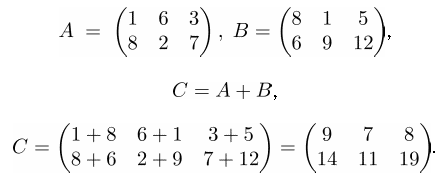
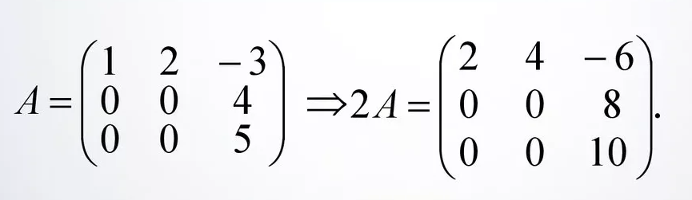
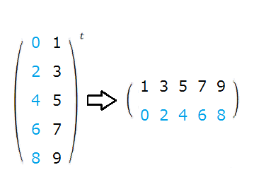
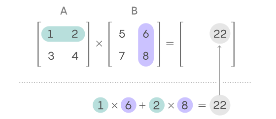
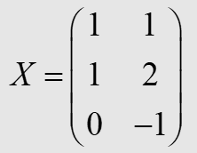
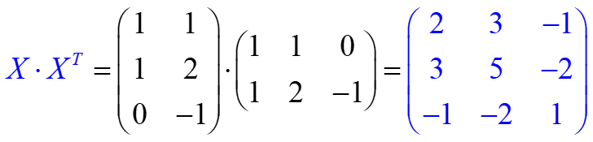
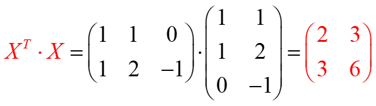

# Линейная алгебра

+ [Векторы](#vectors)
  + [Основные понятия](#vectors_base)
  + [Операции над векторами](#vectors_operations)
  + [Линейная комбинация векторов](#vectors_linear_combination)
  + [Скалярное произведение векторов](#vectors_scalar_multiplication)
  + [Практика](#vectors_practice)
+ [Матрицы](#matrix)
  + [Основные понятия](#matrix_base)
  + [Базовые операции над матрицами](#matrix_operations)
  + [Умножение матриц](#matrix_multiplication)
  + [Умножение матриц (частные случаи)](#matrix_multiplication_spetial)
  + [Делители нуля](#matrix_multiplication_null)
  + [Матрица Грама](#matrix_gram)
  + [Обратные матрицы](#matrix_inverse)
  + [Определитель матрицы](#matrix_determinant)
  + [Практика](#matrix_practice)
+ [Линейная (не)зависимость](#linear_independence)

## <a name="vectors"></a> Векторы

### <a name="vectors_base"></a> Основные понятия

**Что такое вектор?**
+ В школьной геометрии: направленный отрезок.
+ В линейной алгебре: элемент векторного пространства.
+ В _Python_: числовой массив (например, массив NumPy).

>**Вектор** - набор чисел, записанных в определенном порядке (в столбик или в строчку).

**Основные характеристики вектора:**
+ **Координаты вектора** — это числа, из которых он состоит
+ **Размерность вектора** — это количество координат

В _Python_ удобный функционал работы с векторами предоставляет библиотека **numpy**.
Рассмотрим пару способов работы с векторами:

Допустим у нас есть данные о продаже квартиры, которые мы хотим выразить в виде вектора признаков.
* _Общая площадь - 59.5 кв.м._
* _Жилая площадь - 31.5 кв.м._
* _Этаж - 19_
* _Всего этажей - 22_
* _Подъездов в доме - 2_
* _Цена за квадратный метр - 1500$_

Для начала импортируем библиотеку numpy.
```Python
import numpy as np
```
Затем, создадим вектор признаков данной квартиры, который мы сохраним в виде __массива numpy__.
```Python
apartment = np.array([58.5, 31.5, 19, 22, 2, 1500])
```
Данная последовательность чисел и есть __вектор__. Вектор характеризует конкретный объект - в данном случае квартиру.
А числа, которые он хранит, описывают конкретные признаки этого объекта.

Изучим полученный вектор
```Python
# x.ndim - число осей (измерений) массива 
dims = apartment.ndim

# x.shape - размерность массива
shape = apartment.shape
```

Мы можем обращаться к признакам вектора по индексу этого признака. Для примера создадим новый признак из имеющихся.
```Python
living_space_ratio = apartment[0] / apartment[1]
```
Мы создали новый признак - __living_space_ratio__ ___(доля жилой площади)___.
Теперь мы можем избавиться от старых признаков и наоборот, сохранить, новый признак.
```Python
# Удаляем старые признаки
apartment = np.delete(apartment, [0, 1])

# Сохраняем новый признак
apartment = np.append(apartment, living_space_ratio)
```

### <a name="vectors_operations"></a> Операции над векторами

___Сложение векторов.___ Векторы складываются (как и вычитаются) поэлементно, первая координата складывается с первой,
вторая со второй и так далее.


В _Python_ сложение/вычитание векторов реализуется как простые арифметические операции над массивами numpy.
```Python
vec_a = np.array([1, 3, 2])
vec_b = np.array([3, 2, 4])

# Сложение
vec_sum = vec_a + vec_b  # np.array([4, 5, 6])
# Вычитание
vec_subtr = vec_a - vec_b  # np.array([-2, 1, -2])
```

___Умножение вектора на число.___ Умножение вектора происходит аналогичным образом - поэлементно.
То есть каждая ордината вектора умножается на данное число.

Допустим у нас есть вектор ā = (120, 45, 68), который нужно умножить на ω = 0.2.
Тогда, умножение будет выглядеть следующим образом:


В _Python_ умножение векторов происходит аналогично сложению/вычитанию, с помощью простых арифметических операций
над массивами numpy.
```Python
vec_a = np.array([120, 45, 68])
w = .2  # то же самое, что и 0.2

vec_mult = vec_a * w  # np.array([24, 9, 13.6])
```

__Сложение и умножение векторов - особые случаи.__
1. __Сложение противоположных векторов.__ При сложении противоположных векторов, в сумме получается нулевой вектор.
2. __Умножение вектора на ноль__. При умножении вектора на ноль, в сумме получается нулевой вектор.
3. __Умножение на нулевой вектор__. При умножении любого числа на нулевой вектор, в сумме получается нулевой вектор.

### <a name="vectors_linear_combination"></a> Линейная комбинация векторов

> __Линейная комбинация__ - сумма векторов, умноженные на некоторые числа.

Попробуем понять, что это такое, на конкретном примере:

Допустим, у Андрея есть свой блог, в котором он продает рекламу.
Так, за прямую рекламу он получает 100$, за товарную интеграцию 50$ и 0$ за рекламу товаров, которые ему самому понравились.
За последний месяц Андрей продал 3 прямых рекламы, 15 интеграций и бесплатно рекламировал 5 товаров,
а за прошлый месяц 5, 3 и 2 реклам соответственно.

Данные продаж для каждого вида рекламы мы запишем в виде векторов r = (3, 5); i = (15, 3); f = (5, 2).
Тогда, что бы посчитать общую выручку для каждой рекламы за последние 2 месяца мы выразим эти данные в виде формулы:


Это и есть линейная комбинация векторов. Так - Андрей заработал 1050$ за этот месяц и 650$ за прошлый.
_Так как Андрей не получает денег за рекламу по собственной инициативе, количество таких реклам никак не повлияло на общий заработок_

__Нулевая линейная комбинация векторов:__

> __Тривиальная линейная комбинация__ - это такая комбинация векторов, где все коэффициенты равны нулю.

> __Нетривиальная линейная комбинация__ - это такая комбинация векторов, где хотя бы один коэффициент не равен нулю.

__Линейная зависимость векторов__

> __Линейно зависимые векторы__ - это такие векторы, для которых существует нулевая нетривиальная комбинация.

> __Линейно независимые векторы__ - это такие векторы, для которых не существует нулевой нетривиальной комбинации векторов.

__Свойства линейно зависимых векторов:__
1. Если векторы линейно зависимы, то один из них может быть представлен в виде линейной комбинации остальных и обратно,
если один их векторов есть линейная комбинация остальных, то векторы линейно зависимы.
2. Если некоторые из векторов a, b, c ... e линейно зависимы, то и вся эта система линейно зависима.
3. Если среди векторов a, b, c ... e имеется хотя бы один нулевой, то эти векторы линейно зависимы.

### <a name="vectors_scalar_multiplication"></a> Скалярное произведение векторов

__Существует 4 основных способа умножить векторы друг на друга__
1. __Скалярное произведение__ 
2. __Векторное произведение__
3. __Смешанное произведение__
4. __Тензорное произведение__

> __Скалярное произведение вектора__ - это сумма произведений координат векторов.
> 
То есть для того, что бы найти скалярное произведение векторов, нужно перемножить их координаты с одинаковыми индексами
и сложить получившиеся числа.


В _Python_ скалярное произведение можно вычислить при помощи функции dot, библиотеки numpy.
```Python
vec_a = np.array([3, 9, 2])
vec_b = np.array([4, 7, 5])

scalar = np.dot(vec_a, vec_b)  # 85
```

> __Длина вектора__ - это корень суммы квадратов координат вектора.

То есть, длина вектора это корень скалярного произведение вектора с самим собой.
В _Python_ найти длину вектора можно с помощью модуля linalg, библиотеки numpy.
```python
vec = np.array([4, 9, 2, 5])

norm = np.linalg.norm(vec)  # ~11.23
```

Особый случай скалярного произведения - это **ортогональность векторов**.
> **Ортогональные векторы** - это такие векторы, скалярное произведение которые равно нулю.

### <a name="vectors_practice"></a> Практика

```python
# Импортируем библиотеку numpy, которая дает удобный функционал для работы с векторами
import numpy as np

# Вектор можно создать как одномерный массив numpy
vec = np.array([1, 2, 3])  # > array([1, 2, 3])

# Вектор можно создать как одномерный массив numpy, указав тип данных
vec = np.array([1, 2, 3], dtype=float)  # > array([1., 2., 3.])

# Создание нулевого вектора, передав размерность
vec_zeros = np.zeros(5)  # > array([0., 0., 0., 0., 0.])

# Создание единичного вектора, передав размерность
vec_ones = np.ones(5)  # > array([1., 1., 1., 1., 1.])

# Создание вектора чисел по порядку (работает так же, как функция range() python)
vec = np.arange(0, 10, 2)  # > array([0, 2, 4, 6, 8])

# Создание случайного вектора
vec = np.random.randint(0, 3, 10)  # > array([1, 1, 0, 1, 2, 0, 2, 2, 1, 2])

# Создаем векторы для дальнейших примеров
vec_a = np.array([1, 2, 3])
vec_b = np.array([4, 5, 6])

# Сумма векторов и умножение на число
vec_sum = vec_a + vec_b  # > array([5, 7, 9])
vec_multiplication = vec_a * 5  # > array([ 5, 10, 15])

# Линейная комбинация с коэффициентами 4 и 5
vec_linear_combination = 4 * vec_a + 5 * vec_b  # > array([24, 33, 42])

# Скалярное произведение векторов
vec_scalar = vec_a @ vec_b  # > 32

# По координатное произведение векторов
vec_multiplication = vec_a * vec_b  # > array([ 4, 10, 18])

# Создаем вектор для дальнейших примеров
vec = np.array([1, 2, 3])

# Длина вектора
length = np.linalg.norm(vec)  # > 3.7416573867739413

# Нормирование вектора
vec_norm = vec / np.linalg.norm(vec)  # > array([0.26726124, 0.53452248, 0.80178373])
```

## <a name="matrix"></a> Матрицы

### <a name="matrix_base"></a> Основные понятия

> **Матрица** - математический объект, представляющий собой набор чисел, записанных на пересечении строк и столбцов.



В теории, вектор это частный случай матрицы, с размерностью (1, n).

**Виды матриц по форме:**
1. **Прямоугольная**
2. **Квадратная** - *матрица, у которой количество строк равно количеству столбцов*
3. **Вектор-столбец** - *матрица, состоящая из одного столбца*
4. **Вектор-строка** - *матрица, состоящая из одной строки*

**Виды матриц по содержанию:**
1. **Нулевая матрица** - *матрица, все элементы которой равны нулю*
2. **Матрица единиц** - *матрица, все элементы которой равны единице*
3. **Треугольная** (квадратная) - *матрица, все элементы которой ниже, или выше, главной диагонали, равны нулю*
4. **Симметричная** (квадратная) - *матрица, удовлетворяющая условию A=AT*
5. **Диагональная** (квадратная) - *матрица, все элементы которой расположены на главной диагонали*
6. **Cкалярная или шаровая** (квадратная) - *диагональная матрица, элементы которой равны*
7. **Единичная матрица** (квадратная) - *диагональная матрица, элементы которой равны одному*

В *Python* работа с матрицами может осуществляться опять же с помощью библиотеки numpy
```python
import numpy as np

A = np.array([[2, 4], [5, -3]])

# array([[2,  4],
#        [5, -3]])

# Размерность матрицы можно получить с помощью свойства shape
A.shape

# (2, 2)
```

### <a name="matrix_operations"></a> Базовые операции над матрицами

**Сложение матриц**

Матрицы складываются и соответственно вычитаются поэлементно.
При этом, разумеется, матрицы должны быть одинаковой размерности.



**Умножение матрицы на число**

Умножение матрицы на число происходит по аналогии с умножением вектора на скаляр.
Каждый элемент матрицы умножается на это число.
При этом числовые множители можно выносить из матрицы.



*Операторы для сложения и умножения матриц в Python аналогичны операторам векторов.* 

**Транспонирование матриц**

Матрицы, во время транспонирования, поворачивается относительно своей главной диагонали.
При этом столбцы исходной матрицы становятся строками результирующей.

*Частный случай транспонирования матрицы - транспонирование вектора.
Вектор строка после транспонирования становится вектором столбцом и наоборот*

*Транспонированная симметричная матрица равна самой себе* 



Транспонирование в *Python* осуществляется параметром *T* реализуемым в массивах *numpy*.

```python
import numpy as np

matrix = np.matrix('1, 3; 2, 2; 4, 1')

# matrix([[1, 3],
#         [2, 2],
#         [4, 1]])

matrix = matrix.T

# matrix([[1, 2, 4],
#         [3, 2, 1]]])
```

### <a name="matrix_multiplication"></a> Умножение матриц



* Операция умножения матриц возможна в том случае, если число столбцов первой матрицы равно числу строк второй. 
  В этом случае говорят, что матрицы согласованы.
* Умножение матриц не является коммутативной операцией. То есть *A * B* не равно *B * A*.
* Если матрица А имеет *n* строк, а матрица B имеет *m* столбцов, то после умножения мы получим матрицу размерности *n x m*.

В *Python* умножение матриц происходит с помощью функции *np.dot* библиотеки *numpy*.

```python
matrix_a = np.matrix('1,2 ; 3,4')
matrix_b = np.matrix('5,6 ; 7,8')

np.dot(matrix_a, matrix_b)

# matrix([[19, 22],
#         [43, 50]])

np.dot(matrix_b, matrix_a)

# matrix([[23, 34],
#         [31, 46]])
```

**Умножение на вектор**
* Умножать **вектор-столбец** на матрицу можно только с **правой** стороны
* Умножать **вектор-строку** на матрицу можно только с **левой** стороны
* Векторы так же можно умножать друг на друга используя правила тензорного произведения векторов и получая в результате матрицу.

### <a name="matrix_multiplication_spetial"></a> Умножение матриц (частные случаи)

* **Умножение на нулевую матрицу**
  
  Нулевая матрица ведет себя в произведении матриц так же, как и скаляр.
  При умножении матрицы на нулевую матрицу, получается нулевая матрица.

  

* **Умножение на диагональную матрицу**
  
  Диагональные матрицы не коммутативны в общем случае. Но коммутативны между собой.

  

* **Умножение на скалярную матрицу**

  * При умножении на скалярную матрицу, все элементы матрицы A умножатся на скаляр главной диагонали матрицы B.
  
  * Скалярные матрицы перестановочны с любой квадратной матрицей. Результат не зависит от порядка умножения.

  

### <a name="matrix_multiplication_null"></a> Делители нуля

> **Делитель нуля** - это ненулевые элементы, которые при умножении дают ноль.

Элемент *а* может быть:
* **Левым делителем нуля**, если существует ненулевое *b* такое, что ab = 0
* **Правым делителем нуля**, если существует ненулевое *b* такое, что ba = 0

**Элемент, который одновременно является и правым, и левым делителем, называется делителем нуля.**

**Если матрицы *a* и *b* делители нуля, то строки левого сомножителя ортогональны столбцам правого**

### <a name="matrix_gram"></a> Матрица Грама

> **Матрица Грама** - матрица, составленная из скалярных произведений системы векторов.

Допустим, у нас есть система векторов *X*.



Тогда, матрица, составленная из скалярных произведений *строк* матрицы *X*, то бишь матрица Грама, будет выглядеть так:


Матрица скалярных произведений столбцов примет вид:


**Пометки**:
* *Матрица Грамма всегда представляет собой квадратную и симметричную матрицу.*
* *Если векторы линейно независимы, то матрица Грама обратимая.*

### <a name="matrix_inverse"></a> Обратные матрицы

Начнем с понятия обратного числа.
Деление на число в математике можно воспроизвести с помощью умножения на обратное число.


> **Обратное число** - это такое число *a^-1*, которое при умножении на *a* даст единицу.
* Обратное число есть у всех чисел, кроме нуля.
* Обратное число всегда одно и оно коммутативно.

Что же насчет матриц?

> **Обратная матрица** - это такая матрицы *А^-1*, которая при умножении на *А* дает единичную матрицу.

Матрица обратима, если она квадратная и невырождена, то есть ее определитель не равен нулю.

Свойства обратной матрицы:
* 
*  Где *det* - определитель
*  Для двух квадратных обратимых матриц
*  Где *T* - операция транспонирования
*  Для любого коэффициента *k != 0*
*  Где *Е* - единичная матрицы
* Пусть необходимо решить систему уравнений *Ax = b*,
  где *х* - искомый вектор, *b* - ненулевой вектор. 
  Если *A^-1* существует, то *x = bA^-1*. 
  В противном случае либо размерность пространства решений больше 0, либо их нет вовсе.

### <a name="matrix_determinant"></a> Определитель матрицы

> **Определитель матрицы** - это скалярная (числовая) характеристика квадратных матрицы,
> которая является своего рода мерой вырожденности.

Свойства определителя:
* 
* 
* 
* 
* 
* Существует ненулевое решение уравнения *AX = 0* тогда и только тогда,
  когда *det A = 0*. 
  (Или же *det A* должен быть нетривиальным делителем нуля в случае, если *R* - не целостное кольцо)

> **Вырожденная матрица** - это квадратная матрица, определитель которой равен нулю.

**Если определитель матрицы *A* равен нулю, то:**
* Матрица *A* вырождена.
* У матрицы *A* не существует обратной.
* Столбцы или строки матрицы *А* линейно зависимы.

### <a name="matrix_practice"></a> Практика

## <a name="linear_independence"></a> Линейная (не)зависимость
