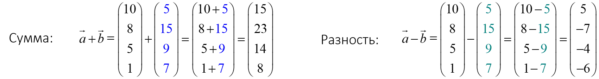
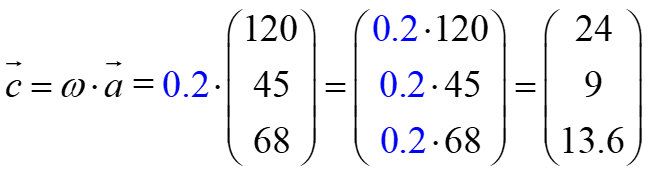
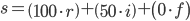
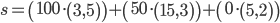
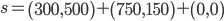
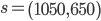
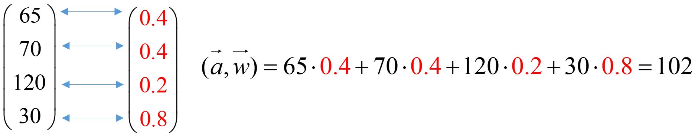

# Линейная алгебра

+ [Векторы](#vectors)
  + [Основные понятия](#vectors_base)
  + [Операции над векторами](#vectors_operations)
  + [Линейная комбинация векторов](#vectors_linear_combination)
  + [Скалярное произведение векторов](#vectors_scalar_multiplication)

## <a name="vectors"></a> Векторы

### <a name="vectors_base"></a> Основные понятия

**Что такое вектор?**
+ В школьной геометрии: направленный отрезок.
+ В линейной алгебре: элемент векторного пространства.
+ В _Python_: числовой массив (например, массив NumPy).

>**Вектор** - набор чисел, записанных в определенном порядке (в столбик или в строчку).

**Основные характеристики вектора:**
+ **Координаты вектора** — это числа, из которых он состоит
+ **Размерность вектора** — это количество координат

В _Python_ удобный функционал работы с векторами предоставляет библиотека **numpy**.
Рассмотрим пару способов работы с векторами:

Допустим у нас есть данные о продаже квартиры, которые мы хотим выразить в виде вектора признаков.
* _Общая площадь - 59.5 кв.м._
* _Жилая площадь - 31.5 кв.м._
* _Этаж - 19_
* _Всего этажей - 22_
* _Подъездов в доме - 2_
* _Цена за квадратный метр - 1500$_

Для начала импортируем библиотеку numpy.
```Python
import numpy as np
```
Затем, создадим вектор признаков данной квартиры, который мы сохраним в виде __массива numpy__.
```Python
apartment = np.array([58.5, 31.5, 19, 22, 2, 1500])
```
Данная последовательность чисел и есть __вектор__. Вектор характеризует конкретный объект - в данном случае квартиру.
А числа, которые он хранит, описывают конкретные признаки этого объекта.

Изучим полученный вектор
```Python
# x.ndim - число осей (измерений) массива 
dims = apartment.ndim

# x.shape - размерность массива
shape = apartment.shape
```

Мы можем обращаться к признакам вектора по индексу этого признака. Для примера создадим новый признак из имеющихся.
```Python
living_space_ratio = apartment[0] / apartment[1]
```
Мы создали новый признак - __living_space_ratio__ ___(доля жилой площади)___.
Теперь мы можем избавиться от старых признаков и наоборот, сохранить, новый признак.
```Python
# Удаляем старые признаки
apartment = np.delete(apartment, [0, 1])

# Сохраняем новый признак
apartment = np.append(apartment, living_space_ratio)
```

### <a name="vectors_operations"></a> Операции над векторами

___Сложение векторов.___ Векторы складываются (как и вычитаются) поэлементно, первая координата складывается с первой,
вторая со второй и так далее.



В _Python_ сложение/вычитание векторов реализуется как простые арифметические операции над массивами numpy.
```Python
vec_a = np.array([1, 3, 2])
vec_b = np.array([3, 2, 4])

# Сложение
vec_sum = vec_a + vec_b  # np.array([4, 5, 6])
# Вычитание
vec_subtr = vec_a - vec_b  # np.array([-2, 1, -2])
```

___Умножение вектора на число.___ Умножение вектора происходит аналогичным образом - поэлементно.
То есть каждая ордината вектора умножается на данное число.

Допустим у нас есть вектор ā = (120, 45, 68), который нужно умножить на ω = 0.2.
Тогда, умножение будет выглядеть следующим образом:



В _Python_ умножение векторов происходит аналогично сложению/вычитанию, с помощью простых арифметических операций
над массивами numpy.
```Python
vec_a = np.array([120, 45, 68])
w = .2  # то же самое, что и 0.2

vec_mult = vec_a * w  # np.array([24, 9, 13.6])
```

__Сложение и умножение векторов - особые случаи.__
1. __Сложение противоположных векторов.__ При сложении противоположных векторов, в сумме получается нулевой вектор.
2. __Умножение вектора на ноль__. При умножении вектора на ноль, в сумме получается нулевой вектор.
3. __Умножение на нулевой вектор__. При умножении любого числа на нулевой вектор, в сумме получается нулевой вектор.

### <a name="vectors_linear_combination"></a> Линейная комбинация векторов

> __Линейная комбинация__ - сумма векторов, умноженные на некоторые числа.

Попробуем понять, что это такое, на конкретном примере:

Допустим, у Андрея есть свой блог, в котором он продает рекламу.
Так, за прямую рекламу он получает 100$, за товарную интеграцию 50$ и 0$ за рекламу товаров, которые ему самому понравились.
За последний месяц Андрей продал 3 прямых рекламы, 15 интеграций и бесплатно рекламировал 5 товаров,
а за прошлый месяц 5, 3 и 2 реклам соответственно.

Данные продаж для каждого вида рекламы мы запишем в виде векторов r = (3, 5); i = (15, 3); f = (5, 2).
Тогда, что бы посчитать общую выручку для каждой рекламы за последние 2 месяца мы выразим эти данные в виде формулы:









Это и есть линейная комбинация векторов. Так - Андрей заработал 1050$ за этот месяц и 650$ за прошлый.
_Так как Андрей не получает денег за рекламу по собственной инициативе, количество таких реклам никак не повлияло на общий заработок_

__Нулевая линейная комбинация векторов:__

> __Тривиальная линейная комбинация__ - это такая комбинация векторов, где все коэффициенты равны нулю.

> __Нетривиальная линейная комбинация__ - это такая комбинация векторов, где хотя бы один коэффициент не равен нулю.

__Линейная зависимость векторов__

> __Линейно зависимые векторы__ - это такие векторы, для которых существует нулевая нетривиальная комбинация.

> __Линейно независимые векторы__ - это такие векторы, для которых не существует нулевой нетривиальной комбинации векторов.

__Свойства линейно зависимых векторов:__
1. Если векторы линейно зависимы, то один из них может быть представлен в виде линейной комбинации остальных и обратно,
если один их векторов есть линейная комбинация остальных, то векторы линейно зависимы.
2. Если некоторые из векторов a, b, c ... e линейно зависимы, то и вся эта система линейно зависима.
3. Если среди векторов a, b, c ... e имеется хотя бы один нулевой, то эти векторы линейно зависимы.

### <a name="vectors_scalar_multiplication"></a> Скалярное произведение векторов

__Существует 4 основных способа умножить векторы друг на друга__
1. __Скалярное произведение__ 
2. __Векторное произведение__
3. __Смешанное произведение__
4. __Тензорное произведение__

> __Скалярное произведение вектора__ - это сумма произведений координат векторов.
> 
То есть для того, что бы найти скалярное произведение векторов, нужно перемножить их координаты с одинаковыми индексами
и сложить получившиеся числа.



В _Python_ скалярное произведение можно вычислить при помощи функции dot, библиотеки numpy.
```Python
vec_a = np.array([3, 9, 2])
vec_b = np.array([4, 7, 5])

scalar = np.dot(vec_a, vec_b)  # 85
```

> __Длина вектора__ - это корень суммы квадратов координат вектора.

То есть, длина вектора это корень скалярного произведение вектора с самим собой.
В _Python_ найти длину вектора можно с помощью модуля linalg, библиотеки numpy.
```python
vec = np.array([4, 9, 2, 5])

norm = np.linalg.norm(vec)  # ~11.23
```

Особый случай скалярного произведения - это __ортогональность векторов__.
> __Ортогональные векторы__ - это такие векторы, скалярное произведение которые равно нулю.


.
